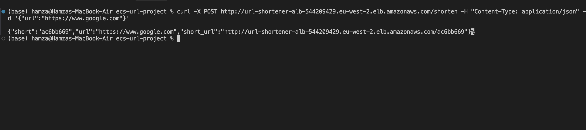
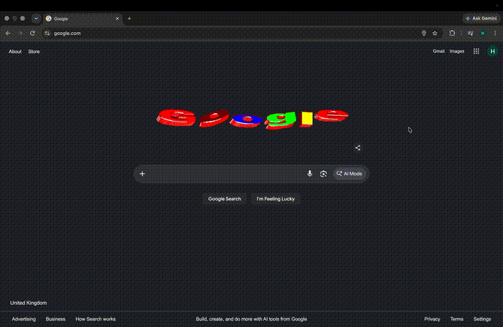
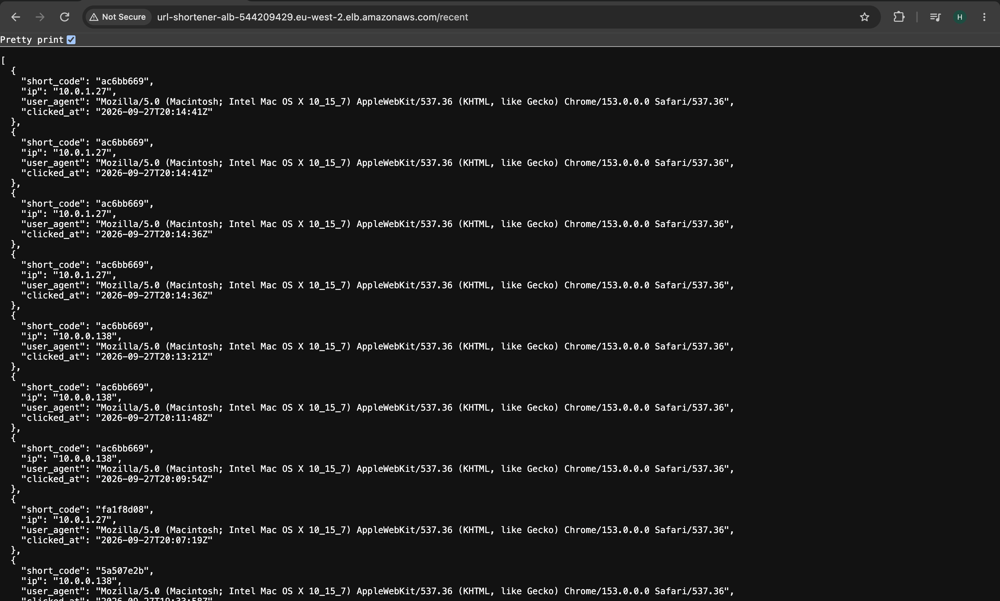
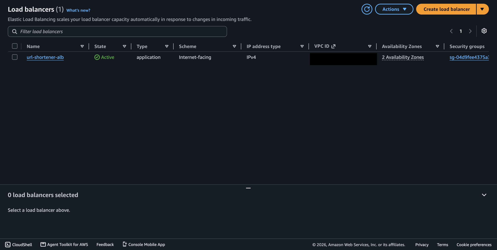
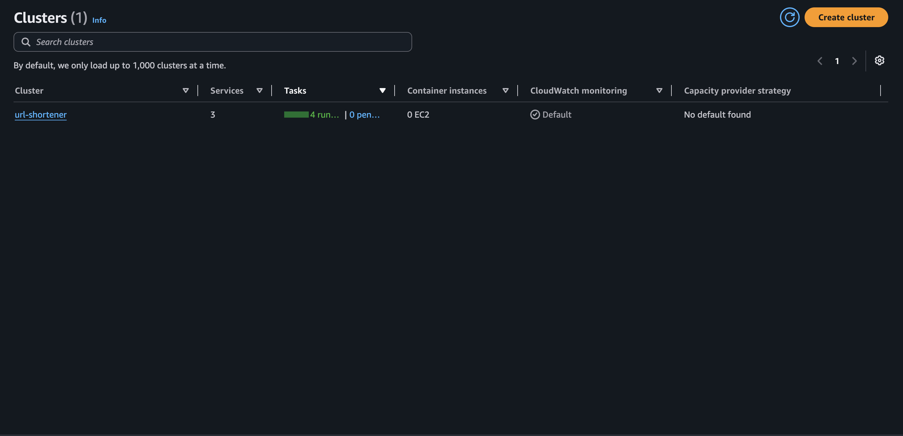
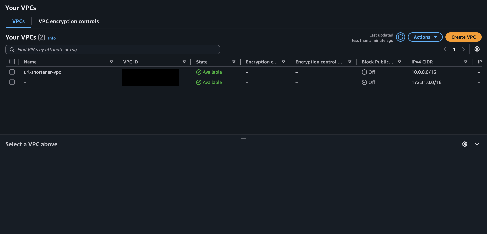
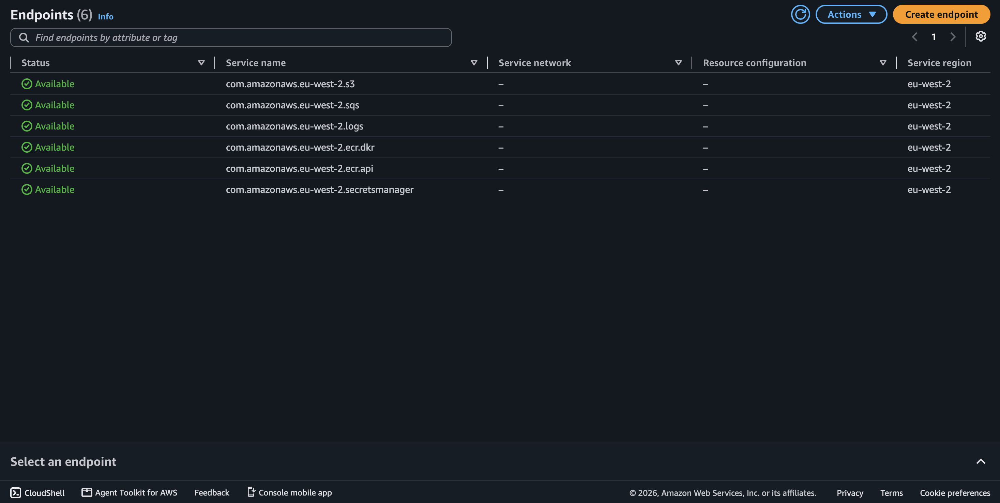
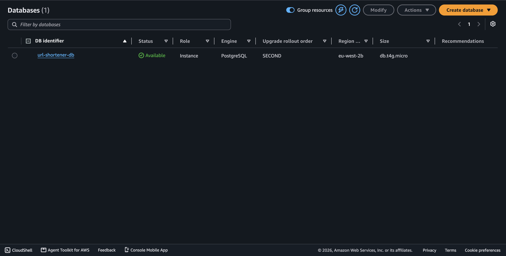
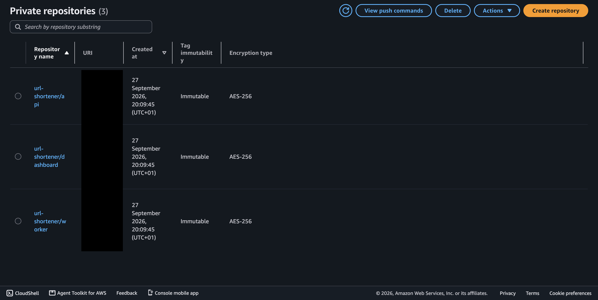

# URL Shortener - ECS Fargate Project

A URL shortener with click analytics, deployed on AWS ECS Fargate. It uses rolling deployments with automatic rollback, AWS WAF protection, and CI/CD through GitHub Actions with OIDC.

## Demo

Shortening a URL through the load balancer:

Opening the short link redirects to the original site:

Each click is published to SQS, processed by the worker and saved to PostgreSQL. The dashboard's `/recent` endpoint then shows the click history:

The screenshots were taken while the stack was running on AWS. It has since been torn down with `terraform destroy` to avoid ongoing costs.

## Architecture Overview

- **Compute:** ECS Fargate running three services (api, worker, dashboard) in one cluster
- **Load Balancing:** Application Load Balancer (ALB) with AWS WAF
- **Storage:** RDS PostgreSQL 16, ElastiCache Redis, SQS with a dead-letter queue
- **Networking:** VPC with private subnets for all services, VPC endpoints (no NAT gateways)
- **Deployments:** ECS rolling deployments with the deployment circuit breaker for automatic rollback
- **CI/CD:** GitHub Actions with OIDC authentication and Trivy security scanning

## Architecture Explanation

The service is split into three containers. The **api** (Python, FastAPI) shortens URLs and handles redirects. The **worker** (Go) processes click events in the background. The **dashboard** (Go) serves analytics. All three run on ECS Fargate in private subnets and are managed with Terraform.

### Traffic Flow

1. **Internet** → Requests enter through the public internet.
2. **AWS WAF** → Blocks IPs sending more than 1000 requests in 5 minutes, and filters common attacks using the AWS managed rule set.
3. **Application Load Balancer** → Sits in the public subnets across two availability zones and routes by path:
   - `/summary`, `/top`, `/recent` and `/url/*` go to the dashboard
   - all other paths go to the api

   

4. **ECS Services** → The api, worker and dashboard run as three services in one ECS cluster, in private subnets with no public IPs. The load balancer only sends traffic to tasks that pass the `/healthz` check.

   

5. **Click events** → When a short link is opened, the api returns a redirect and publishes a click event to SQS.
6. **Worker** → Long-polls SQS, writes each event to PostgreSQL, and deletes the message only after it has been saved.

### Networking

All resources live in one VPC (`10.0.0.0/16`) spread across two availability zones:

- **Public Subnets (2 AZs):** Host only the ALB, with an Internet Gateway for inbound traffic.
- **Private Subnets (2 AZs):** Host the ECS tasks, RDS and Redis. The private route table has no route to the internet.
- **VPC Endpoints:** Give the tasks private access to ECR, S3, CloudWatch Logs, SQS and Secrets Manager without a NAT gateway.

  

- **Security Groups:** The api and dashboard only accept traffic from the ALB. RDS only accepts the three services, and Redis only accepts the api. The worker accepts no inbound traffic. Outbound traffic from the services is limited to the VPC and S3.

### Data Layer

- **RDS PostgreSQL:** Stores URL mappings, click events and hourly click stats. I chose PostgreSQL over DynamoDB because the worker and dashboard are written for Postgres, and the dashboard depends on relational queries such as totals, hourly grouping and upserts.

  

- **SQS:** Decouples redirects from analytics, so a slow database write never slows down a redirect. Messages that fail 5 times move to a dead-letter queue.
- **ElastiCache Redis:** The caching layer for the api, encrypted at rest and in transit.
- **Secrets Manager:** Holds the database connection string. The password is generated by Terraform and injected into the containers at startup, so it never appears in code.
- **CloudWatch Logs:** Centralised logs for all three services, kept for 7 days.

### Container Registry

ECR holds one private repository per service. Images are tagged with the git commit SHA, and tags are immutable, so every deployment can be traced to an exact commit. Images are encrypted and scanned on push.

### CI/CD Pipeline

- **GitHub Actions:** Three workflows. `ci.yml` builds and scans the images on every pull request. `terraform.yml` formats, validates and scans the infrastructure code. `cd.yml` deploys on merge to main.
- **OIDC:** GitHub authenticates to AWS with short-lived credentials. The deploy role can only be used by this repository's main branch, and can only push to the three image repositories and update the three services.
- **Trivy:** Scans every image before it is pushed, and fails the pipeline on any high or critical vulnerability that has a fix.
- **Terraform:** All infrastructure is split into modules, with remote state in S3 and native state locking.

### Key Features Highlighted

- High availability across 2 availability zones
- Security: private subnets, WAF protection, least-privilege IAM roles for each service, no stored credentials
- No NAT gateways: VPC endpoints for all AWS service access
- Zero-downtime deployments with automatic rollback
- Vulnerability scanning on every pull request and deployment

## Rolling Deployment Process

Every merge to main is deployed by the CD pipeline. ECS replaces the running tasks gradually, so users are never left without a healthy version.

### Step 1: New Image Built and Pushed

The pipeline builds the image, scans it with Trivy, tags it with the commit SHA and pushes it to ECR. A new task definition revision is registered with the new image.

### Step 2: New Tasks Started

ECS starts the new tasks alongside the existing ones. The deployment is set to a minimum of 100% and a maximum of 200% healthy capacity, so the old version keeps serving all traffic while the new tasks start up.

### Step 3: Health Checks

The ALB checks `/healthz` on each new task. A task needs 2 passing checks before it receives traffic, and it gets a 60-second grace period to start. The worker has no load balancer, so ECS runs a container health check against its own `/healthz` endpoint instead.

### Step 4: Traffic Shift Complete

Once the new tasks are healthy, the ALB sends traffic to them and the old tasks are drained. Old tasks get 30 seconds to finish their in-flight requests before they stop.

### Step 5: Automatic Rollback on Failure

If the new tasks keep failing their health checks, the ECS deployment circuit breaker stops the rollout and restores the last working version. The pipeline then checks which version is running. If ECS rolled back, the pipeline fails, so the developer knows the release did not go out.
