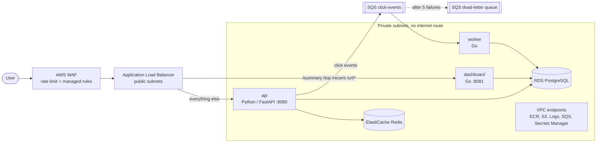

# URL Shortener with Click Analytics on AWS ECS Fargate

Three containerised services (a Python API, a Go queue worker and a Go analytics API) running on **ECS Fargate** in private subnets with **no NAT gateway**, fronted by an **ALB + WAF**. They are backed by **RDS PostgreSQL**, **ElastiCache Redis** and **SQS**. Everything is built with **modular Terraform** and deployed by **GitHub Actions over OIDC**, with zero-downtime rolling deployments that roll back automatically when health checks fail.

> Built for the CoderCo ECS Project v2 brief. The application code was provided; I designed and built the containers, infrastructure, CI/CD, security controls and deployment process. I also implemented the worker's missing SQS consumer and upgraded vulnerable dependencies found by scanning.

---

## At a glance

| Area | What I built |
|---|---|
| **Compute** | 1 ECS cluster, 3 Fargate services (ARM64 / Graviton), rolling deploys with circuit-breaker rollback |
| **Networking** | VPC across 2 AZs, public subnets for the ALB only, private subnets for everything else, **no NAT**, 6 VPC endpoints |
| **Edge** | Application Load Balancer with path-based routing, WAF with rate limiting and AWS managed rules |
| **Data** | RDS PostgreSQL 16, ElastiCache Redis 7 (encrypted in transit and at rest), SQS with a dead-letter queue |
| **Security** | Per-service IAM roles scoped to single resources, secrets in Secrets Manager, OIDC for CI (no stored AWS keys), Trivy image + IaC scanning, pinned GitHub Actions |
| **IaC** | Terraform, 8 modules, S3 remote state with native state locking, versioned and encrypted |
| **CI/CD** | 3 workflows: CI (build + scan), Terraform (fmt, validate, scan), CD (build, scan, push, deploy, verify) |

---

## Architecture



**Request flow:**
1. `POST /shorten` → WAF → ALB → **api** stores the mapping in Postgres.
2. `GET /{code}` → **api** looks up the URL, returns a redirect and publishes a click event to SQS.
3. **worker** long-polls SQS, writes the event and an hourly aggregate to Postgres, then deletes the message.
4. `GET /top`, `/summary`, `/recent`, `/url/{code}` → ALB routes to **dashboard**, which reads the analytics.

---

## The deployment workflow: from merge to live traffic

This is how a developer's change reaches users within minutes, with no downtime and an automatic safety net.

```
Pull request
  ├─ CI         build all 3 images → Trivy scan (fail on fixable HIGH/CRITICAL)
  └─ Terraform  fmt → validate → Trivy config scan          (only if infra/ changed)
        │
   review + merge to main
        │
        ▼
CD (runs for api, worker, dashboard in parallel)
  1. Authenticate to AWS with OIDC      → short-lived credentials, no stored keys
  2. Build image, tag = git commit SHA  → ECR tags are immutable, so a tag always means one exact build
  3. Trivy scan                         → vulnerable images never reach ECR
  4. Push to ECR
  5. Fetch current task definition, swap in the new image, register a new revision
  6. Update the ECS service and wait for it to become stable
  7. Verify ECS did not roll back       → fail the pipeline if it did
```

**What ECS does during step 6:**

| Setting | Effect |
|---|---|
| `minimum_healthy_percent = 100`, `maximum_percent = 200` | New tasks start **alongside** the old ones. Capacity never drops below 100%. |
| ALB health check `GET /healthz` every 15s, 2 passes to be healthy | New tasks only get traffic once they prove they can reach the database |
| `health_check_grace_period = 60s` | Slow starts are not mistaken for failures |
| `deregistration_delay = 30s` | Old tasks finish their in-flight requests before they stop |
| **Deployment circuit breaker** (`rollback = true`) | If new tasks keep failing, ECS **stops the rollout and restores the last working version** by itself |
| Worker has no ALB | A container health check (`curl localhost:8090/healthz`, which pings the database) plays the same role |

**Why the extra verification step (7)?** When the circuit breaker rolls back, the service becomes "stable" again on the *old* version, so the standard "wait for stability" check reports success. Without step 7 a failed release would show a **green** pipeline. Step 7 compares the running task definition with the one just deployed and fails loudly if they differ.

**Other safeguards:**
- `concurrency: cd` queues overlapping merges, so two deployments never race each other.
- The deploy role can only be assumed by **this repository's `main` branch** (OIDC `sub` claim).
- Infrastructure changes are applied deliberately with `terraform plan` / `apply`. The pipeline deploys application code only, which keeps the CI role small.
- **Manual rollback:** revert the commit and merge. CD redeploys the previous code as a new, traceable release.

---

## Key design decisions

### Database: RDS PostgreSQL over DynamoDB
The worker and dashboard are written against PostgreSQL (`lib/pq`). The dashboard relies on relational queries: sums across tables, grouping clicks by hour, ordering by popularity, and an `ON CONFLICT` upsert for hourly aggregates. DynamoDB would need those services rewritten and extra access patterns designed around their queries. Postgres fits the data and the existing code, and a `db.t4g.micro` instance keeps it cheap.

### No NAT gateway: VPC endpoints instead
Private tasks still need AWS APIs, so each dependency gets a private endpoint:

| Endpoint | Why it's needed |
|---|---|
| `ecr.api`, `ecr.dkr` | Authenticate and fetch image manifests |
| `s3` (gateway, free) | ECR stores image layers in S3 |
| `logs` | Container logs to CloudWatch |
| `secretsmanager` | `DATABASE_URL` injected at task start |
| `sqs` | api publishes, worker consumes |

RDS, Redis and the ALB live inside the VPC, so they need no endpoint. The private route table has **no route to the internet at all**, so a compromised container has no path out.

### Routing two services behind one ALB
The API treats any path as a short code (`/{short_id}`), which collides with the dashboard's `/top`, `/summary` and so on. Rather than changing application code, the ALB sends **exactly** `/summary`, `/top`, `/recent` and `/url/*` to the dashboard and everything else to the API. This is safe because short codes are always 8 hexadecimal characters (`sha256(url)[:8]`), so they can never equal one of those words.

### Rolling deployments over blue/green
Rolling with the circuit breaker meets the zero-downtime and auto-rollback requirements with far less moving parts: no second set of target groups and no traffic-shifting controller. Blue/green would add instant rollback and canary traffic shifting, at the cost of double capacity during releases. It's the next step if release risk grew.

### ARM64 (Graviton) Fargate
About 20% cheaper than x86 for the same size. It matches both Apple Silicon (images built locally run unchanged) and GitHub's `ubuntu-24.04-arm` runners, so there is no cross-compilation or emulation anywhere.

### Separate IAM roles per service
One execution role (used by ECS to start tasks) and one task role per service (used by the code):

| Role | Permissions | Scope |
|---|---|---|
| execution | pull images, write logs, read one secret | the 3 ECR repos, `/ecs/url-shortener/*` log groups, the `database-url` secret |
| api task | `sqs:SendMessage` | the click-events queue only |
| worker task | `sqs:ReceiveMessage`, `sqs:DeleteMessage` | the click-events queue only |
| dashboard | **no task role** | it only talks to Postgres |
| GitHub deploy | push images, register task definitions, update services, pass the 3 task roles | the 3 repos, the 3 services, `iam:PassedToService = ecs-tasks` |

The only `Resource = "*"` entries are `ecr:GetAuthorizationToken` and the task-definition APIs, where AWS does not support resource-level permissions.

### Network least privilege
| Security group | Inbound | Outbound |
|---|---|---|
| alb | 80 from the internet | VPC only |
| api | 8080 from the ALB SG only | VPC + S3 prefix list |
| dashboard | 8081 from the ALB SG only | VPC + S3 prefix list |
| worker | **nothing** | VPC + S3 prefix list |
| rds | 5432 from api, worker, dashboard SGs | none |
| redis | 6379 from the api SG only | none |

Rules reference **security groups, not IPs**, so new tasks created during a deployment are trusted automatically.

### Secrets
The database password is generated by Terraform (`random_password`), set on RDS and stored in Secrets Manager as a full `DATABASE_URL`. ECS injects it at start-up, so it never appears in code, task definition environment variables or the repository. Connections use `sslmode=require`.

### Remote state
A separate `bootstrap` stack creates the state bucket with versioning, encryption, all public access blocked, a TLS-only bucket policy, `prevent_destroy`, and a lifecycle rule for old versions. Locking uses Terraform's **native S3 lockfile** (`use_lockfile`), so no DynamoDB lock table is needed.

---

## Security scanning and supply chain

- **Trivy image scans** run on every PR and again in CD before push. The first scan found **45 known vulnerabilities** (1 critical) in the Go standard library and in Starlette. I fixed them by moving the Go builds to 1.26 and FastAPI to 0.141, then re-tested the full flow: 0 fixable HIGH/CRITICAL remain.
- **Trivy IaC scans** check the Terraform. They flagged unrestricted egress on the app security groups, which I tightened to VPC + S3 only. Three remaining findings are **accepted risks, documented** in [`.trivyignore`](.trivyignore) with reasons (public ALB by design, HTTP because there's no domain, SSE-S3 instead of a customer-managed key for the state bucket).
- **Every third-party action is pinned to a full commit SHA**, so a hijacked tag cannot inject code into a pipeline that holds AWS credentials.
- Workflows declare minimal `permissions`. Only CD can request an OIDC token.
- **Containers:** multi-stage builds, slim runtime images, non-root user, and Go binaries built static with `CGO_ENABLED=0`.

---

## Problems I hit and how I solved them

| Problem | Root cause | Fix | What I learned |
|---|---|---|---|
| Worker would never process clicks | `receiveSQSMessages` was a stub that returned nothing, and messages were never deleted | Implemented long polling (20s, batches of 10) with the AWS SDK v2, deleting only after a successful DB write. Failures stay on the queue and go to the DLQ after 5 attempts. | Deleting only after success gives at-least-once processing, and the DLQ stops poison messages looping forever |
| A failed deploy showed a green pipeline | The stability waiter succeeds after the circuit breaker rolls back | Added a step comparing the running task definition with the deployed one | Always verify the *outcome*, not just that the tool finished |
| Terraform dependency cycle between IAM and ECS | The execution role needed log group ARNs, while ECS needed the role ARN | Built the log-group ARN from a known naming pattern inside the IAM module | Design module boundaries around one-way data flow |
| `terraform apply` would fail creating the OIDC provider | An account can only have one provider per URL, and one already existed | Looked it up with a `data` source instead of creating it | Check for account-wide singletons before creating them |
| Worker has no load balancer to health-check it | Slim Debian images have no `curl` | Installed `curl` in the runtime stage and added an ECS container health check on `:8090/healthz` | Services without an ALB still need a health signal, or rollback can't work |
| Native S3 state locking was unavailable | Local Terraform was 1.5.7, and `use_lockfile` needs 1.10+ | Upgraded to Terraform 1.16 and dropped the DynamoDB lock table | Keep tooling current, because newer versions remove whole resources |
| Tearing down from CI would need an admin role | `terraform destroy` needs permission to delete everything | Kept teardown as a deliberate local action | A convenience is not worth a standing admin credential in CI |

---

## Repository layout

```
.
├── .github/workflows/
│   ├── ci.yml              # PR: build + Trivy scan each image
│   ├── terraform.yml       # PR (infra/ changes): fmt, validate, Trivy config scan
│   └── cd.yml              # main: OIDC → build → scan → push → deploy → verify
├── app/                    # api (Python / FastAPI) + multi-stage Dockerfile
├── services/
│   ├── worker/             # SQS consumer (Go) + Dockerfile
│   └── dashboard/          # analytics API (Go) + Dockerfile
├── infra/
│   ├── bootstrap/          # state bucket (applied once)
│   ├── backend.tf          # S3 backend with native locking
│   ├── main.tf             # wires the modules together
│   └── modules/
│       ├── vpc/            # VPC, subnets, routes, VPC endpoints, security groups
│       ├── ecr/            # 3 repos: immutable tags, scan on push, keep last 10
│       ├── sqs/            # click-events queue + dead-letter queue
│       ├── database/       # RDS PostgreSQL, ElastiCache Redis, DATABASE_URL secret
│       ├── alb/            # ALB, target groups, routing rule, WAF (waf.tf)
│       ├── iam/            # execution role + per-service task roles
│       ├── ecs/            # cluster, log groups, task definitions, services
│       └── github-oidc/    # CI deploy role, scoped to this repo's main branch
└── .trivyignore            # accepted IaC risks, with reasons
```

---

## Deploying it yourself

**Prerequisites:** Terraform ≥ 1.10, AWS CLI v2, Docker, and an AWS account. If you use a different account, replace the account ID in `infra/backend.tf` (state bucket name) and `.github/workflows/cd.yml`.

```bash
# 1. Remote state (once)
cd infra/bootstrap
terraform init && terraform apply

# 2. Image repositories first, so there is something for ECS to run
cd ..
terraform init
terraform apply -target=module.ecr -var image_tag=bootstrap

# 3. Build and push the first images, tagged with the current commit
TAG=$(git rev-parse HEAD)
REGISTRY=<account-id>.dkr.ecr.eu-west-2.amazonaws.com
aws ecr get-login-password | docker login --username AWS --password-stdin $REGISTRY
for s in api:app worker:services/worker dashboard:services/dashboard; do
  name=${s%%:*}; path=${s#*:}
  docker build -t $REGISTRY/url-shortener/$name:$TAG ../$path
  docker push $REGISTRY/url-shortener/$name:$TAG
done

# 4. Everything else
terraform apply -var image_tag=$TAG
```

From then on, every merge to `main` deploys automatically through CD.

**Verify the end-to-end flow:**
```bash
URL=$(terraform -chdir=infra output -raw app_url)

curl -X POST $URL/shorten -H 'Content-Type: application/json' -d '{"url":"https://github.com"}'
curl -I $URL/<short>           # 307 redirect → click event published to SQS
curl $URL/recent               # the click, processed by the worker
curl $URL/top
curl $URL/summary
```

**Tear down** (the ALB, WAF, endpoints and databases cost money even when idle):
```bash
cd infra && terraform destroy -var image_tag=destroy
```

---

## Cost

Rough on-demand estimate for eu-west-2 at this size:

| Component | ~ Monthly |
|---|---|
| VPC interface endpoints (5 × 2 AZs) | $80 |
| Fargate ARM, 4 tasks × 0.25 vCPU / 512 MB | $23 |
| Application Load Balancer | $20 |
| RDS `db.t4g.micro` + 20 GB gp3 | $16 |
| ElastiCache `cache.t4g.micro` | $13 |
| WAF (web ACL + 2 rules) | $7 |
| Secrets Manager, CloudWatch Logs, ECR, SQS | ~$3 |
| **Total** | **~$160 / month (~$5 / day)** |

**An honest note on endpoints versus NAT:** at this scale, interface endpoints cost about the same as a pair of NAT gateways. The win is **security and blast radius, not cost**: there is no internet egress path at all. To cut cost I would place the interface endpoints in one AZ (roughly halving the largest line item), accepting that an AZ outage would also take out AWS API access.

---

## Trade-offs and what I'd do next

| Current choice | Why | Production next step |
|---|---|---|
| HTTP only | No domain, so no certificate | Route 53 domain + ACM certificate, HTTP → HTTPS redirect |
| Single-AZ RDS, 1-day backups, no final snapshot | Cost, and fast teardown for a demo | Multi-AZ, 7–30 day backups, deletion protection |
| Rolling deployments | Simple, meets zero-downtime + rollback | ECS native blue/green with canary traffic shifting |
| One environment | Scope | Staging → production with manual approval via GitHub Environments |
| Images built in CI and again in CD | Simplicity | Build once and promote the same digest |
| Redis provisioned but unused by the API | The provided API has no cache code yet | Cache-aside on `get_mapping` with a TTL, invalidated on write |
| No alarms | Scope | CloudWatch alarms on 5xx rate, unhealthy hosts and DLQ depth, notified via SNS |
| Fixed task counts | Predictable cost | Target-tracking auto scaling on CPU and ALB request count |
| No test stage | The provided tests aren't wired up | Run `pytest` and `go vet` in CI before building |

---

## Author

**Hamza Alsoodani**. [GitHub](https://github.com/HamzaAlsoodani)
